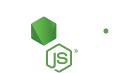

<div align="center">

  

# DevWonders

  <p align="center">
    <strong>The Pragmatic, Zero-Dependency Web Development Knowledge Base</strong><br>
    <em>Master modern native browser APIs, cutting-edge CSS, and clean architectural patterns without bloated third-party libraries.</em>
  </p>

  <p align="center">
    <a href="https://ldrawe.github.io/devwonders/"></a>
    <a href="https://github.com/LDrawe/devwonders"></a>
    <a href="https://github.com/LDrawe/devwonders/blob/main/LICENSE"></a>
    <a href="https://github.com/LDrawe/devwonders/stargazers"></a>
  </p>

  <p align="center">
    <a href="https://ldrawe.github.io/devwonders/"><strong>🌐 Explore Live Wiki</strong></a> •
    <a href="#-topics-covered"><strong>📚 Topics</strong></a> •
    <a href="#-interactive-features"><strong>⚡ Interactive Features</strong></a> •
    <a href="#-local-development"><strong>💻 Quick Start</strong></a> •
    <a href="#-contributing"><strong>🤝 Contributing</strong></a>
  </p>

</div>

---

> ### 💡 The Philosophy
>
> **Stop installing 500 KB npm packages for problems the modern web platform already solves natively.**  
> DevWonders is a curated reference manual designed to empower developers with pure HTML5, CSS3, modern ECMAScript, and robust terminal workflows — zero bundlers, zero framework lock-in, and 100% platform-first engineering.

---

## 🌟 Highlights & Features

<table>
  <tr>
    <td width="50%" valign="top">
      <h3>🚀 Zero Build Step & Instant Load</h3>
      <p>Built entirely with native ES Modules and HTML/CSS. Clone the repository and serve it immediately — no <code>node_modules</code>, no Webpack/Vite overhead, no waiting for compiles.</p>
    </td>
    <td width="50%" valign="top">
      <h3>⚡ In-Place Interactive JS Runner</h3>
      <p>Execute verified JavaScript code snippets right inside the documentation. Features a custom lightweight console terminal drawer with syntax-highlighted output (<code>log</code>, <code>warn</code>, <code>error</code>).</p>
    </td>
  </tr>
  <tr>
    <td width="50%" valign="top">
      <h3>🎨 Live Interactive CSS Demos</h3>
      <p>Explore cutting-edge CSS features like <code>@starting-style</code>, <code>text-wrap: balance</code>, dynamic units (<code>cap</code>, <code>svh</code>), and Anchor Positioning with real-time interactive controls.</p>
    </td>
    <td width="50%" valign="top">
      <h3>🧩 Native Web Components Architecture</h3>
      <p>Clean UI orchestration powered by reusable Custom Elements (<code>&lt;app-header&gt;</code>, <code>&lt;app-sidebar&gt;</code>) and centralized data routing via <code>topics.json</code>.</p>
    </td>
  </tr>
</table>

---

## 📚 Topics Covered

Each category features real-world recipes, code snippets, and live interactive examples:

| Topic                                                                                      | Focus & Highlights                                                                                |                                  Quick Link                                   |
| :----------------------------------------------------------------------------------------- | :------------------------------------------------------------------------------------------------ | :---------------------------------------------------------------------------: |
|  **HTML5**     | Native `<dialog>` Modals, Popover API, `inert` Focus Trapping, Adaptive Favicons, Template Slots  |    [**View Guide →**](https://ldrawe.github.io/devwonders/pages/html.html)    |
|  **CSS3**       | Anchor Positioning, `@starting-style` transitions, `text-wrap: balance`, `light-dark()`, Cap Unit |    [**View Guide →**](https://ldrawe.github.io/devwonders/pages/css.html)     |
|  **JavaScript**  | `Object.groupBy()`, `AbortController` cleanup, Native UUID, Numeric Separators, Code Runner       |     [**View Guide →**](https://ldrawe.github.io/devwonders/pages/js.html)     |
|  **TypeScript**  | Utility Types (`Partial`, `Required`, `Extract`), Type Narrowing, Discriminated Unions            | [**View Guide →**](https://ldrawe.github.io/devwonders/pages/typescript.html) |
|  **Node.js**   | Native Fetch API, Built-in Test Runner, Watch Mode (`--watch`), Native SQLite Client              |    [**View Guide →**](https://ldrawe.github.io/devwonders/pages/node.html)    |
|  **Git**        | `git worktree` multi-branch workflows, `bisect` bug tracking, `rerere`, stash tricks              |    [**View Guide →**](https://ldrawe.github.io/devwonders/pages/git.html)     |
|  **VS Code** | Multi-cursor workflows, Regex find & replace, Case transformation, Essential Shortcuts            |   [**View Guide →**](https://ldrawe.github.io/devwonders/pages/vscode.html)   |

---

## ⚡ Interactive Features

### 🖥️ In-Page Code Runner

Certain JavaScript snippets include a runnable badge with built-in execution controls:

- **Run (▶)**: Evaluates the snippet safely in real-time.
- **Clear (🗑)**: Resets the mini terminal drawer.
- **Console Interception**: Captures formatted objects, arrays, primitives, and errors directly in the styled UI drawer without needing DevTools.

```javascript
// Example of a runnable recipe:
const users = [
  { name: "Alice", role: "admin" },
  { name: "Bob", role: "user" },
  { name: "Charlie", role: "admin" },
];

const byRole = Object.groupBy(users, (user) => user.role);
console.log(byRole);
```

---

## 💻 Local Development

Because DevWonders relies solely on native web standards, you can spin up the development environment in seconds with any local HTTP server:

### 1. Clone the repository

```bash
git clone https://github.com/LDrawe/devwonders.git
cd devwonders
```

### 2. Start a local server (Pick any):

```bash
# Using VS Code
# Simply right-click index.html -> "Open with Live Server"

# OR Using Python 3 (Built-in)
python -m http.server 8000

# OR using Node.js
npx serve .
```

### 3. Open in your browser

Navigate to `http://localhost:8000` and start exploring!

---

## 🤝 Contributing

Contributions make open-source thrive! Whether it's adding a new native trick, improving an interactive demo, or fixing documentation, your help is welcome.

### How to add a new tip:

1. **Fork & Branch**: Create a descriptive feature branch:

   ```bash
   git checkout -b feature/native-file-system-api
   ```

2. **Pick the Right File**: Open the corresponding page in `pages/` (e.g., `pages/js.html`).

3. **Follow the Standard Component Structure**:

   ```html
   <section>
     <h2>Feature Title</h2>
     <p>
       Concise explanation of the problem, why third-party libraries aren't
       needed, and how the native platform accomplishes it.
     </p>
     <div>
       <div>
         <div class="language-control"></div>
         <pre><code class="language-javascript code-block">
   // Clean, copy-pasteable example
               </code></pre>
       </div>
     </div>
   </section>
   ```

4. **Commit & Push**:

   ```bash
   git commit -m "feat(html): add Popover API interactive recipe"
   git push origin feature/native-file-system-api
   ```

5. **Open a Pull Request**: Submit your PR with a clear summary of your addition.

---

## ⚖️ Dual License

To ensure both snippet reusability and project preservation, DevWonders uses a dual-licensing model:

- **Code Snippets & Examples**: Released under the [MIT License](https://opensource.org/licenses/MIT). Feel free to copy, modify, and integrate code directly into personal or commercial projects.
- **Documentation, Design & Branding**: Released under the [Creative Commons Attribution-ShareAlike 4.0 International (CC BY-SA 4.0)](https://creativecommons.org/licenses/by-sa/4.0/) license.

---

<div align="center">

Crafted with care by [**Eduardo (LDrawe)**](https://github.com/LDrawe)

[**Live Wiki**](https://ldrawe.github.io/devwonders/) •
[**Report Issue**](https://github.com/LDrawe/devwonders/issues) •
[**Request Feature**](https://github.com/LDrawe/devwonders/pulls)

<sub>Copyright © 2026 DevWonders. Powered by the open web platform.</sub>

</div>
